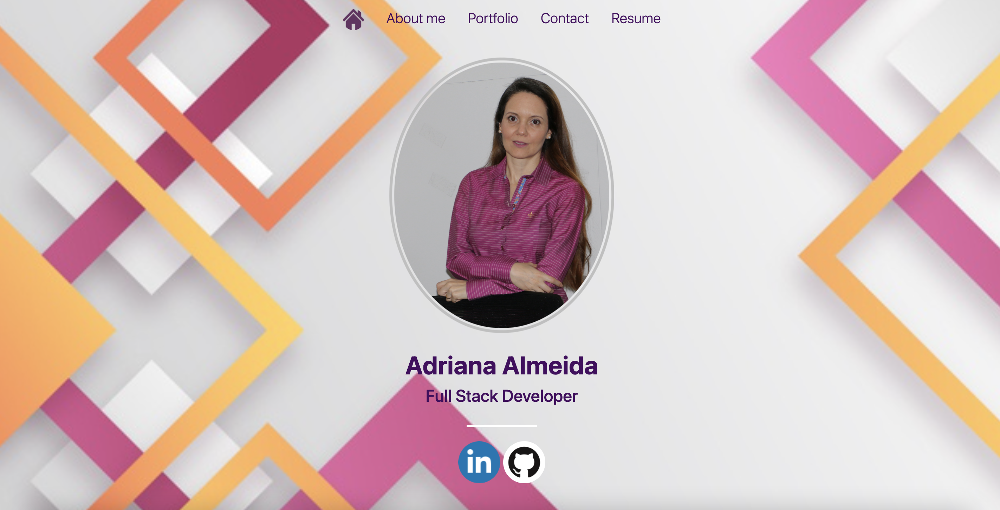

# Professional_Portfolio
My portfolio was built using React with JSX, regular CSS style and Bootstrap. You will find some projects that I developed during the Full Stack Bootcamp.

### Installation
npm install react-router-dom --save

### `npm start`

Runs the app in the development mode.\
Open [http://localhost:3000](http://localhost:3000) to view it in the browser.

The page will reload if you make edits.\
You will also see any lint errors in the console.

### Deploy Heroku
https://portfolio-dri.herokuapp.com

### Technology
React with JSX
BootStrap 4.0

### Question
For more questions about Team Profile Generator you can go to my Github page at the follow link:

### Question

For more questions about Team Profile Generator you can go to my Github page at the follow link:

  - [GitHub Profile](https://github.com/adriana-carmo)
  - [GitHub Professional Portfolio Repo](https://github.com/adriana-carmo/Professional_Portfolio) 

For additional questions please reach out to my e-mail at : dri.abedala@gmail.com